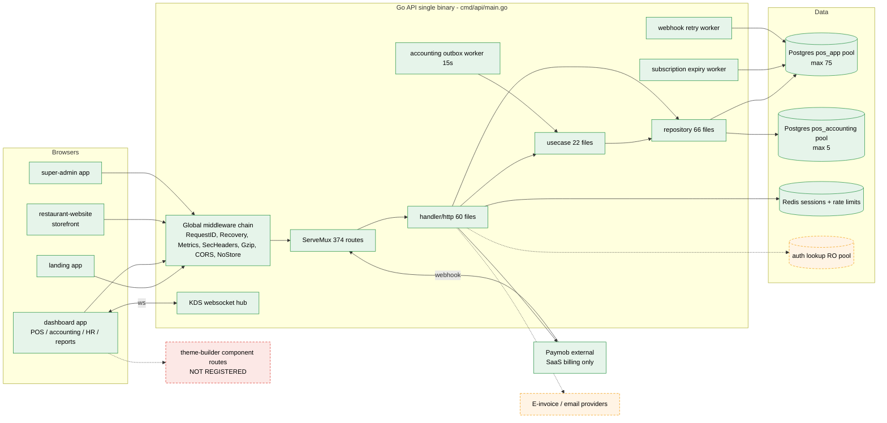

# Diagram 01 - System architecture

Legend: green solid = VERIFIED in source; orange dashed = UNVERIFIED; red dashed = missing/broken connection.

```mermaid
flowchart LR
  classDef ok fill:#e6f4ea,stroke:#1e8e3e,color:#000
  classDef unv fill:#fff4e5,stroke:#f29900,stroke-dasharray:5 3,color:#000
  classDef bad fill:#fce8e6,stroke:#d93025,stroke-dasharray:5 3,color:#000

  subgraph Browsers
    LAND[landing app]:::ok
    DASH[dashboard app<br/>POS / accounting / HR / reports]:::ok
    SITE[restaurant-website<br/>storefront]:::ok
    SA[super-admin app]:::ok
  end
  subgraph API[Go API single binary - cmd/api/main.go]
    MW[Global middleware chain<br/>RequestID, Recovery, Metrics, SecHeaders, Gzip, CORS, NoStore]:::ok
    MUX[ServeMux 374 routes]:::ok
    H[handler/http 60 files]:::ok
    UC[usecase 22 files]:::ok
    REPO[repository 66 files]:::ok
    W1[accounting outbox worker 15s]:::ok
    W2[subscription expiry worker]:::ok
    W3[webhook retry worker]:::ok
    WS[KDS websocket hub]:::ok
  end
  subgraph Data
    PGA[(Postgres pos_app pool<br/>max 75)]:::ok
    PGL[(Postgres pos_accounting pool<br/>max 5)]:::ok
    RED[(Redis sessions + rate limits)]:::ok
    LOOK[(auth lookup RO pool)]:::unv
  end
  PAYMOB[Paymob external<br/>SaaS billing only]:::ok
  EINV[E-invoice / email providers]:::unv
  TBMISS[theme-builder component routes<br/>NOT REGISTERED]:::bad

  LAND --> MW
  DASH --> MW
  SITE --> MW
  SA --> MW
  MW --> MUX --> H
  H --> UC --> REPO
  H --> REPO
  REPO --> PGA
  REPO --> PGL
  H --> RED
  W1 --> UC
  W2 --> PGA
  W3 --> PGA
  DASH <-->|ws| WS
  H --> PAYMOB
  PAYMOB -->|webhook| MUX
  H -.-> EINV
  H -.-> LOOK
  DASH -.-> TBMISS
```
