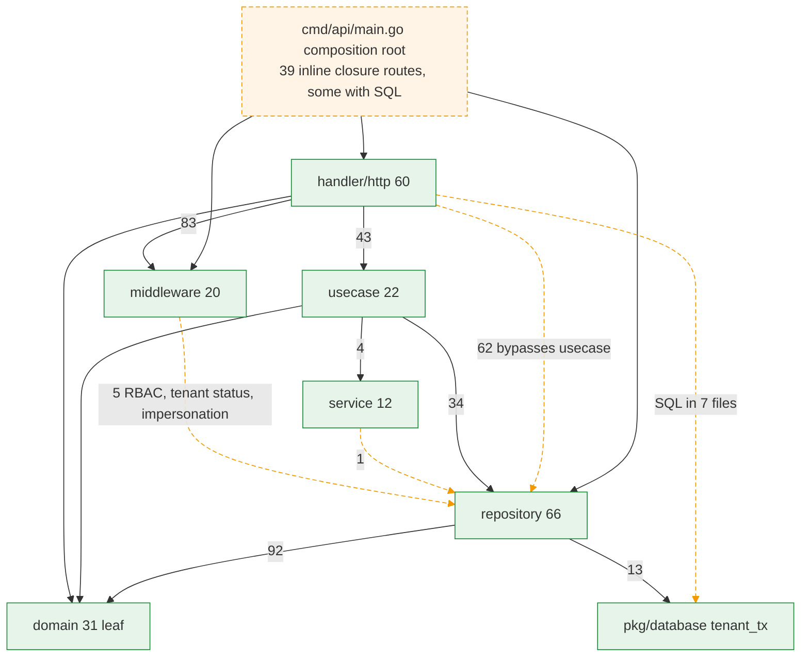

# Diagram 03 - Backend layer dependencies

Edge labels are import-statement counts in non-test Go files. Orange dashed = layering exceptions (VERIFIED by grep).

```mermaid
flowchart TD
  classDef ok fill:#e6f4ea,stroke:#1e8e3e
  classDef warn fill:#fff4e5,stroke:#f29900,stroke-dasharray:5 3
  main[cmd/api/main.go composition root<br/>39 inline closure routes, some with SQL]:::warn
  mw[middleware 20]:::ok
  h[handler/http 60]:::ok
  uc[usecase 22]:::ok
  svc[service 12]:::ok
  repo[repository 66]:::ok
  dom[domain 31 leaf]:::ok
  dbp[pkg/database tenant_tx]:::ok
  main --> h
  main --> mw
  main --> repo
  h -- 83 --> mw
  h -- 43 --> uc
  h -- "62 bypasses usecase" --> repo
  h -- "SQL in 7 files" --> dbp
  uc -- 34 --> repo
  uc -- 4 --> svc
  svc -- 1 --> repo
  mw -- "5 RBAC, tenant status, impersonation" --> repo
  repo -- 92 --> dom
  uc --> dom
  h --> dom
  repo -- 13 --> dbp
  linkStyle 5 stroke:#f29900,stroke-dasharray:5 3
  linkStyle 6 stroke:#f29900,stroke-dasharray:5 3
  linkStyle 9 stroke:#f29900,stroke-dasharray:5 3
  linkStyle 10 stroke:#f29900,stroke-dasharray:5 3
```
