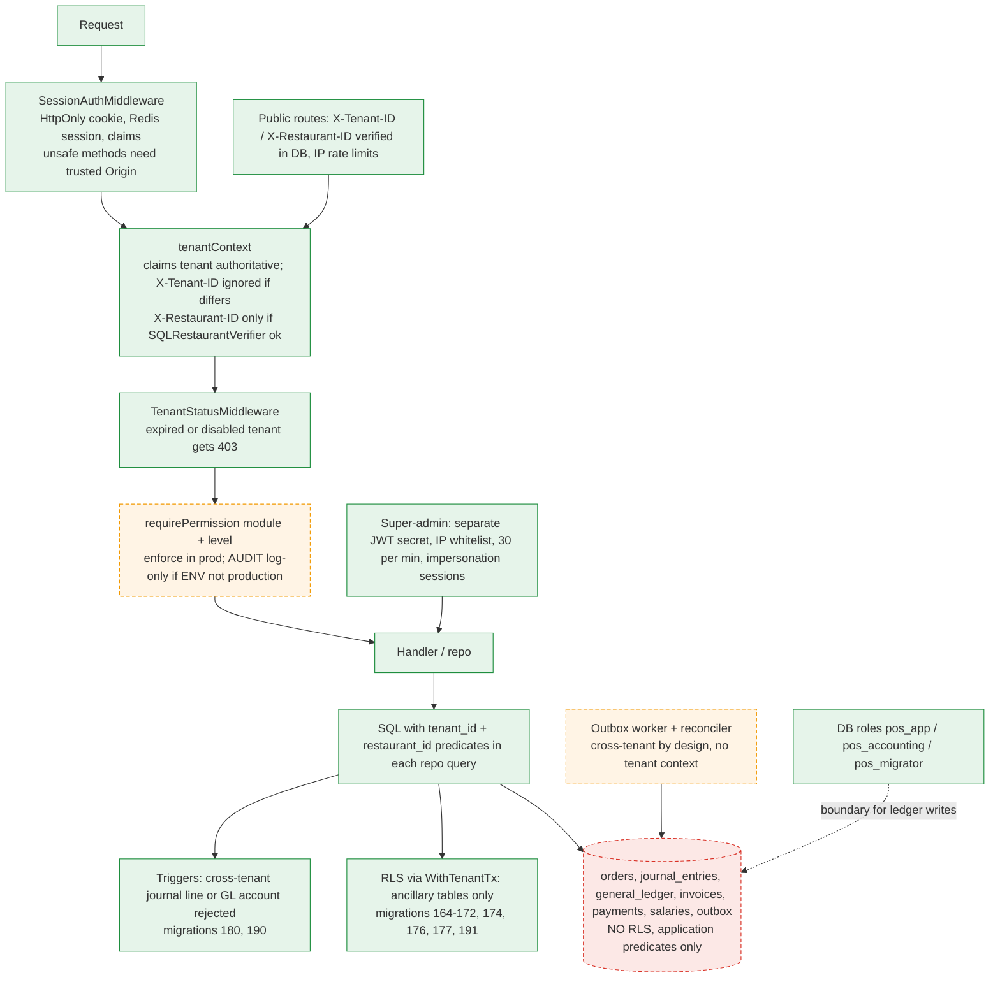

# Diagram 07 - Tenant isolation boundaries

Legend: green = verified control; orange dashed = conditional/unverified; red dashed = control absent.

```mermaid
flowchart TB
  classDef ok fill:#e6f4ea,stroke:#1e8e3e
  classDef unv fill:#fff4e5,stroke:#f29900,stroke-dasharray:5 3
  classDef bad fill:#fce8e6,stroke:#d93025,stroke-dasharray:5 3
  REQ[Request]:::ok --> AUTH[SessionAuthMiddleware<br/>HttpOnly cookie, Redis session, claims<br/>unsafe methods need trusted Origin]:::ok
  AUTH --> TC[tenantContext<br/>claims tenant authoritative; X-Tenant-ID ignored if differs<br/>X-Restaurant-ID only if SQLRestaurantVerifier ok]:::ok
  TC --> ST[TenantStatusMiddleware<br/>expired or disabled tenant gets 403]:::ok
  ST --> PERM[requirePermission module + level<br/>enforce in prod; AUDIT log-only if ENV not production]:::unv
  PERM --> HND[Handler / repo]:::ok
  HND --> Q[SQL with tenant_id + restaurant_id predicates in each repo query]:::ok
  Q --> TRG[Triggers: cross-tenant journal line or GL account rejected<br/>migrations 180, 190]:::ok
  Q --> RLS[RLS via WithTenantTx: ancillary tables only<br/>migrations 164-172, 174, 176, 177, 191]:::ok
  Q --> CORE[(orders, journal_entries, general_ledger, invoices, payments, salaries, outbox<br/>NO RLS, application predicates only)]:::bad
  WK[Outbox worker + reconciler<br/>cross-tenant by design, no tenant context]:::unv --> CORE
  PUB[Public routes: X-Tenant-ID / X-Restaurant-ID verified in DB, IP rate limits]:::ok --> TC
  SA[Super-admin: separate JWT secret, IP whitelist, 30 per min, impersonation sessions]:::ok --> HND
  ROLES[DB roles pos_app / pos_accounting / pos_migrator]:::ok -.->|boundary for ledger writes| CORE
```
