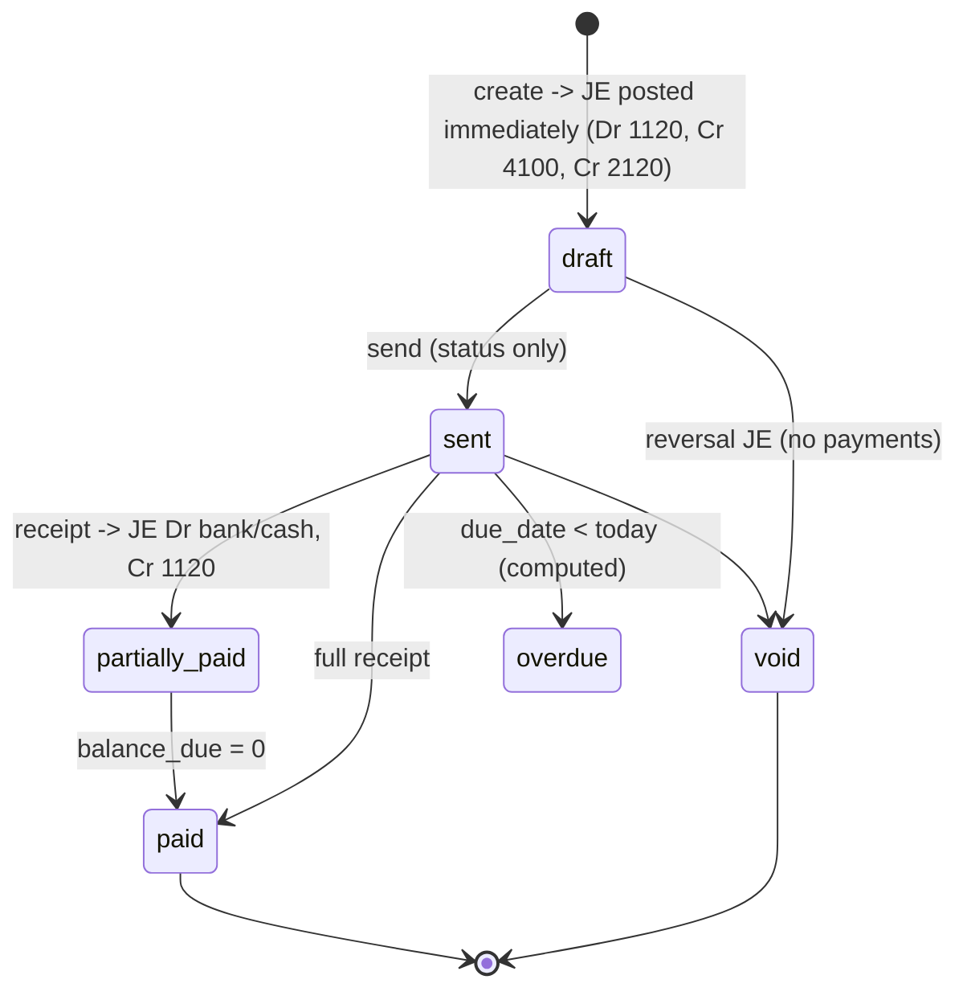

# customer-invoice-flow

```mermaid
stateDiagram-v2
  [*] --> draft: create -> JE posted immediately (Dr 1120, Cr 4100, Cr 2120)
  draft --> sent: send (status only)
  sent --> partially_paid: receipt -> JE Dr bank/cash, Cr 1120
  partially_paid --> paid: balance_due = 0
  sent --> paid: full receipt
  sent --> overdue: due_date < today (computed)
  draft --> void: reversal JE (no payments)
  sent --> void
  paid --> [*]
  void --> [*]

```
