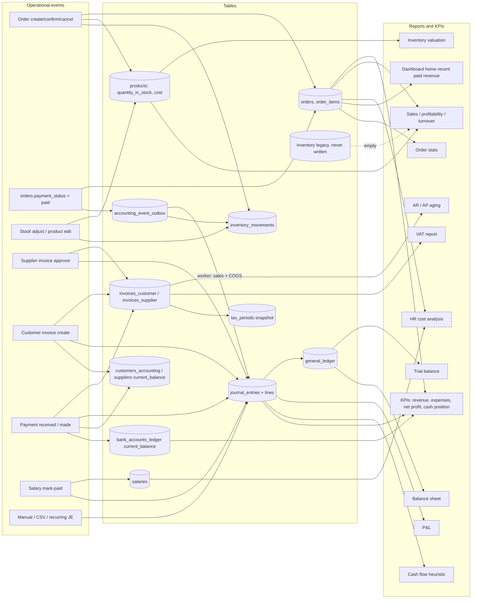

# Financial data lineage (operational events -> tables -> reports)

Source analysis: see 27-financial-data-lineage.md. Label: CONFIRMED-BY-SOURCE.

```mermaid
flowchart LR
    subgraph Ops[Operational events]
        O1[Order create/confirm/cancel]
        O2[orders.payment_status = paid]
        O3[Stock adjust / product edit]
        O4[Supplier invoice approve]
        O5[Customer invoice create]
        O6[Payment received / made]
        O7[Salary mark-paid]
        O8[Manual / CSV / recurring JE]
    end
    subgraph Stores[Tables]
        T1[(orders, order_items)]
        T2[(products: quantity_in_stock, cost)]
        T3[(inventory_movements)]
        T4[(accounting_event_outbox)]
        T5[(journal_entries + lines)]
        T6[(general_ledger)]
        T7[(invoices_customer / invoices_supplier)]
        T8[(customers_accounting / suppliers current_balance)]
        T9[(bank_accounts_ledger current_balance)]
        T10[(salaries)]
        T11[(inventory legacy, never written)]
        T12[(tax_periods snapshot)]
    end
    subgraph Rep[Reports and KPIs]
        R1[P&L]
        R2[Trial balance]
        R3[Balance sheet]
        R4[Cash flow heuristic]
        R5[AR / AP aging]
        R6[Inventory valuation]
        R7[KPIs: revenue, expenses, net profit, cash position]
        R8[Sales / profitability / turnover]
        R9[VAT report]
        R10[HR cost analysis]
        R11[Dashboard home recent paid revenue]
        R12[Order stats]
    end
    O1 --> T1
    O1 --> T2
    O1 --> T3
    O2 --> T1
    O2 --> T4
    T4 -->|worker: sales + COGS| T5
    T4 --> T3
    O3 --> T2
    O3 --> T3
    O4 --> T7
    O4 --> T5
    O5 --> T7
    O5 --> T5
    O5 --> T8
    O6 --> T7
    O6 --> T5
    O6 --> T8
    O6 --> T9
    O7 --> T10
    O7 --> T5
    O8 --> T5
    T5 --> T6
    T5 --> R1
    T5 --> R4
    T5 --> R7
    T6 --> R2
    T6 --> R3
    T7 --> R5
    T7 --> R9
    T7 --> T12
    T2 --> R6
    T2 --> R8
    T1 --> R7
    T1 --> R8
    T1 --> R10
    T1 --> R11
    T1 --> R12
    T9 --> R7
    T10 --> R10
    T11 -.empty.-> R8
```
