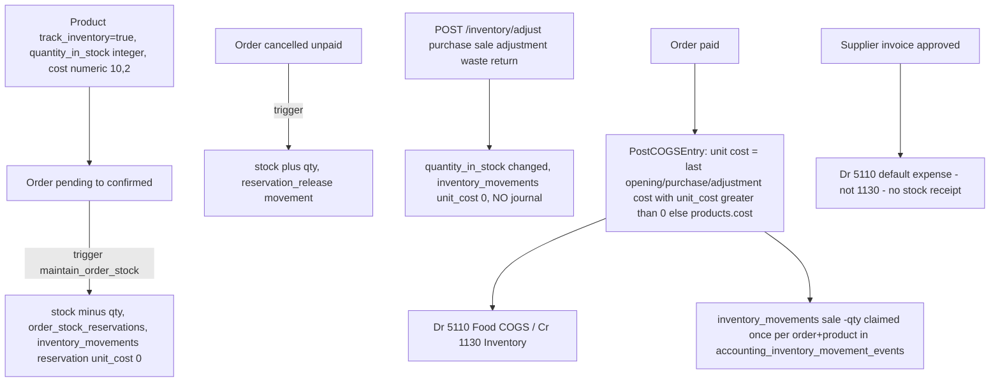

# inventory-cogs-flow

```mermaid
flowchart TD
  P[Product track_inventory=true, quantity_in_stock integer, cost numeric 10,2] --> OC[Order pending to confirmed]
  OC -->|trigger maintain_order_stock| RS[stock minus qty, order_stock_reservations, inventory_movements reservation unit_cost 0]
  OC2[Order cancelled unpaid] -->|trigger| RL[stock plus qty, reservation_release movement]
  ADJ[POST /inventory/adjust purchase sale adjustment waste return] --> MV[quantity_in_stock changed, inventory_movements unit_cost 0, NO journal]
  PAID[Order paid] --> COGS[PostCOGSEntry: unit cost = last opening/purchase/adjustment cost with unit_cost greater than 0 else products.cost]
  COGS --> JE[Dr 5110 Food COGS / Cr 1130 Inventory]
  COGS --> SM[inventory_movements sale -qty claimed once per order+product in accounting_inventory_movement_events]
  SUP[Supplier invoice approved] --> EXP[Dr 5110 default expense - not 1130 - no stock receipt]

```
