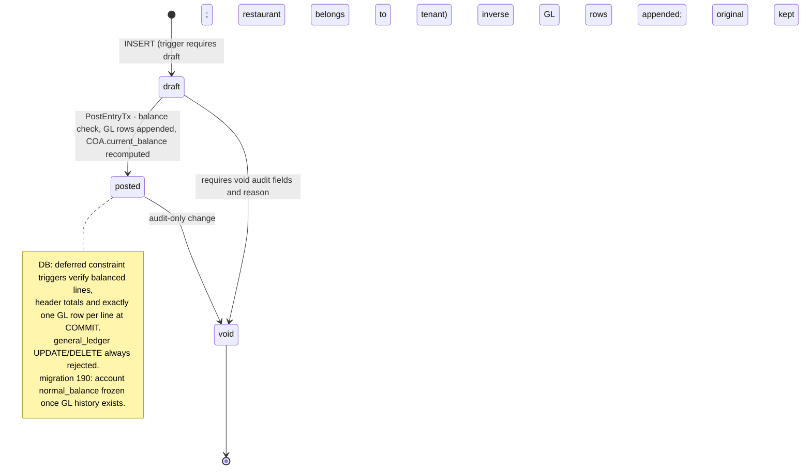

# journal-posting-flow

```mermaid
stateDiagram-v2
  [*] --> draft: INSERT (trigger requires draft; restaurant belongs to tenant)
  draft --> posted: PostEntryTx - balance check, GL rows appended, COA.current_balance recomputed
  draft --> void: requires void audit fields and reason
  posted --> void: audit-only change; inverse GL rows appended; original rows kept
  void --> [*]
  note right of posted
    DB: deferred constraint triggers verify balanced lines,
    header totals and exactly one GL row per line at COMMIT.
    general_ledger UPDATE/DELETE always rejected.
    migration 190: account normal_balance frozen once GL history exists.
  end note

```
