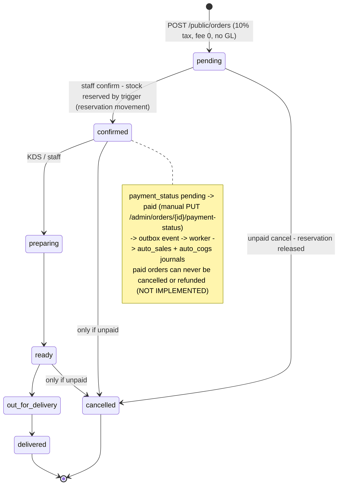

# online-order-lifecycle

```mermaid
stateDiagram-v2
  [*] --> pending: POST /public/orders (10% tax, fee 0, no GL)
  pending --> confirmed: staff confirm - stock reserved by trigger (reservation movement)
  pending --> cancelled: unpaid cancel - reservation released
  confirmed --> preparing: KDS / staff
  preparing --> ready
  ready --> out_for_delivery
  out_for_delivery --> delivered
  confirmed --> cancelled: only if unpaid
  ready --> cancelled: only if unpaid
  delivered --> [*]
  cancelled --> [*]
  note right of confirmed
    payment_status pending -> paid (manual PUT /admin/orders/{id}/payment-status)
    -> outbox event -> worker -> auto_sales + auto_cogs journals
    paid orders can never be cancelled or refunded (NOT IMPLEMENTED)
  end note

```
