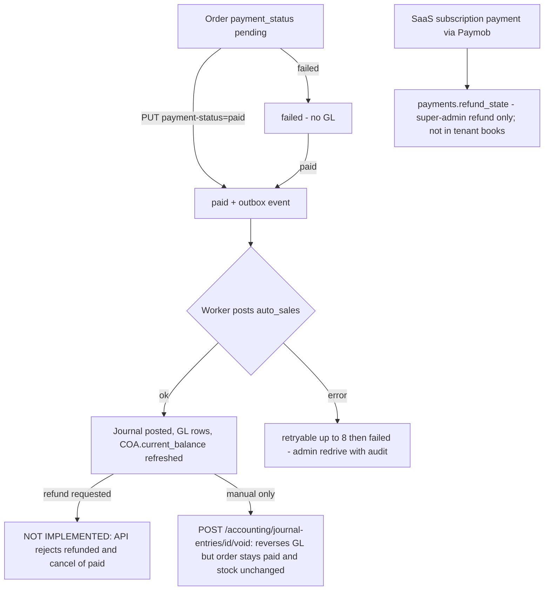

# payment-refund-flow

```mermaid
flowchart TD
  A[Order payment_status pending] -->|PUT payment-status=paid| B[paid + outbox event]
  A -->|failed| F[failed - no GL]
  F -->|paid| B
  B --> C{Worker posts auto_sales}
  C -->|ok| D[Journal posted, GL rows, COA.current_balance refreshed]
  C -->|error| E[retryable up to 8 then failed - admin redrive with audit]
  D -->|refund requested| X[NOT IMPLEMENTED: API rejects refunded and cancel of paid]
  D -->|manual only| V[POST /accounting/journal-entries/id/void: reverses GL but order stays paid and stock unchanged]
  S[SaaS subscription payment via Paymob] --> R[payments.refund_state - super-admin refund only; not in tenant books]

```
