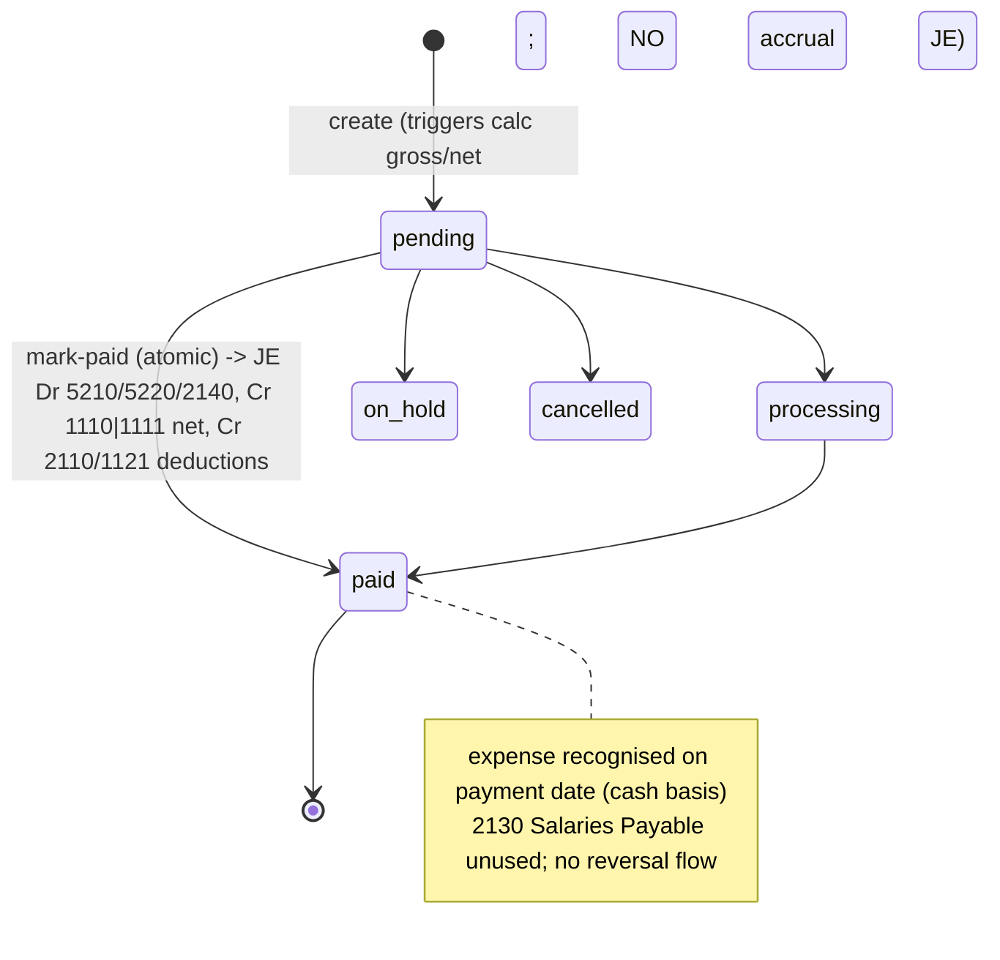

# payroll-flow

```mermaid
stateDiagram-v2
  [*] --> pending: create (triggers calc gross/net; NO accrual JE)
  pending --> processing
  pending --> on_hold
  pending --> cancelled
  pending --> paid: mark-paid (atomic) -> JE Dr 5210/5220/2140, Cr 1110|1111 net, Cr 2110/1121 deductions
  processing --> paid
  paid --> [*]
  note right of paid
    expense recognised on payment date (cash basis)
    2130 Salaries Payable unused; no reversal flow
  end note

```
