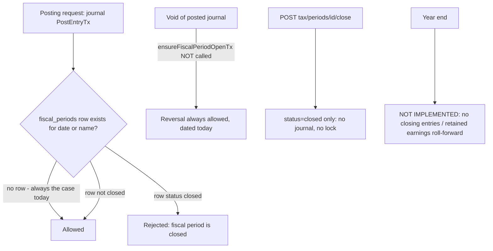

# period-closing-flow

```mermaid
flowchart TD
  A[Posting request: journal PostEntryTx] --> B{fiscal_periods row exists for date or name?}
  B -->|no row - always the case today| C[Allowed]
  B -->|row status closed| D[Rejected: fiscal period is closed]
  B -->|row not closed| C
  V[Void of posted journal] -->|ensureFiscalPeriodOpenTx NOT called| W[Reversal always allowed, dated today]
  T[POST tax/periods/id/close] --> U[status=closed only: no journal, no lock]
  Y[Year end] --> Z[NOT IMPLEMENTED: no closing entries / retained earnings roll-forward]

```
