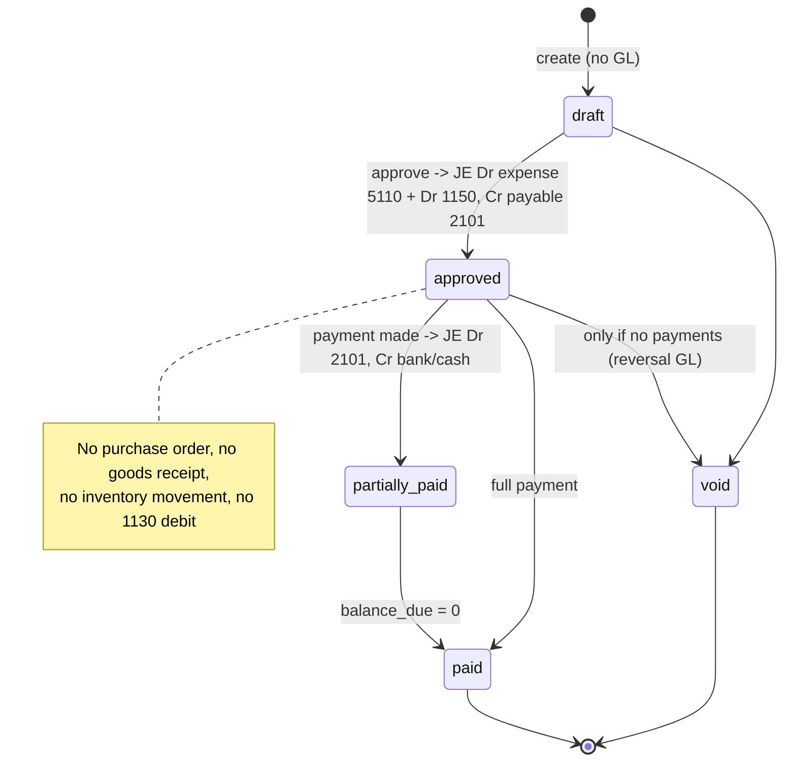

# supplier-purchase-flow

```mermaid
stateDiagram-v2
  [*] --> draft: create (no GL)
  draft --> approved: approve -> JE Dr expense 5110 + Dr 1150, Cr payable 2101
  approved --> partially_paid: payment made -> JE Dr 2101, Cr bank/cash
  partially_paid --> paid: balance_due = 0
  approved --> paid: full payment
  approved --> void: only if no payments (reversal GL)
  draft --> void
  paid --> [*]
  void --> [*]
  note right of approved
    No purchase order, no goods receipt,
    no inventory movement, no 1130 debit
  end note

```
